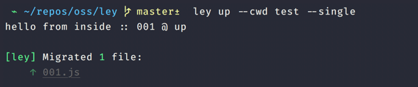
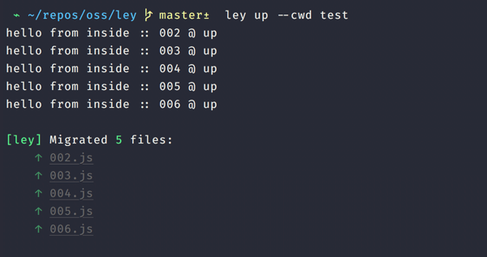
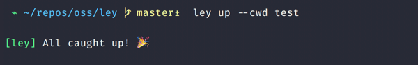

<div align="center">
  
</div>

<div align="center">
  <a href="https://npmjs.org/package/ley">
    
  </a>
  <a href="https://github.com/lukeed/ley/actions">
    
  </a>
  <a href="https://npmjs.org/package/ley">
    
  </a>
</div>

<div align="center">Driver agnostic database migrations</div>

## TODO

> **WIP:** What's here is the end of Night #1

- [ ] driver support:
  - [x] [`pg`](https://www.npmjs.com/package/pg)
  - [x] [`postgres`](https://www.npmjs.com/package/postgres)
  - [x] [`mysql`](https://www.npmjs.com/package/mysql)
  - [x] [`mysql2`](https://www.npmjs.com/package/mysql2)
  - [x] [`better-sqlite3`](https://www.npmjs.com/package/better-sqlite3)
  - [ ] [`sqlite`](https://www.npmjs.com/package/sqlite)
- [ ] complete test coverage
- [ ] complete documentation

## Features

* **Agnostic**<br>
  _Supports [`postgres`](https://www.npmjs.com/package/postgres), [`pg`](https://www.npmjs.com/package/pg), [`better-sqlite3`](https://www.npmjs.com/package/better-sqlite3), [`sqlite`](https://www.npmjs.com/package/sqlite), [`mysql`](https://www.npmjs.com/package/mysql), [`mysql2`](https://www.npmjs.com/package/mysql2), and [custom drivers!](#drivers)_

* **Lightweight**<br>
  _Does **not** include any driver dependencies._

* **Transactional**<br>
  _Runs all migration files within a transaction for rollback safety._

* **Familiar**<br>
  _Does **not** invent new syntax or abstractions.<br>You're always working directly with your driver of choice._

* **Flexible**<br>
  _Find the CLI to restrictive? You may require `ley` for your own scripting!_


## Install

```
$ npm install --save-dev ley
```


## Usage

> Both [Programmatic](#programmatic) and [CLI](#cli) usages are supported.

### Setup

You must have a `migrations` directory created, preferably in your project's root.

> **Note:** You may configure the target directory and location.

Your filenames within this directory determine _the order of their execution._<br>
Because of this, it's often recommended to prefix migrations with a timestamp or numerical sequence.

***Numerical Sequence***

```
/migrations
  |-- 000-users.js
  |-- 001-teams.js
  |-- 002-seats.js
```

> **Note**: You may create the next file via `ley new todos --length 3` where `todos` is a meaningful name.<br>The above command will create the `migrations/003-todos.js` filepath.

***Timestamped***

```
/migrations
  |-- 1581323445-users.js
  |-- 1581323453-teams.js
  |-- 1581323458-seats.js
```

> **Note**: You may create the next file via `ley new todos --timestamp` where `todos` is a meaningful name.<br>The above command will create the `migrations/1584389617-todos.js` filepath...or similar.


**The order of your migrations is critically important!**<br>Migrations must be treated as an append-only immutable task chain. Without this, there's no way to _reliably_ rollback or recreate your database.

> **Example:** (Above) You cannot apply/create `001-teams.js` _after_ `002-seats.js` has already been applied.<br>Doing so would force your teammates or database replicas to recreate "the world" in the wrong sequence.<br>This may not _always_ pose a problem (eg, unrelated tasks) but it **often does** and so `ley` enforces this practice.

Lastly, each migration file must have an `up` and a `down` task.<br>
These must be exported functions &mdash; `async` okay! &mdash; and will receive your pre-installed client driver as its only argument:

```js
exports.up = async function (DB) {
  // with `pg` :: DB === pg.Client
  await DB.query(`select * from users`);

  // with `postgres` :: DB === sql``
  await DB`select * from users`;
}

exports.down = async function (DB) {
  // My pre-configured "undo" function
}
```

### CLI

  1) Add `ley` as one of your `package.json` scripts; `"migrate"`, for example:

      ```js
      // package.json
      {
        "scripts": {
          "migrate": "ley"
        }
      }
      ```

  2) Invoke `ley up` to apply new migrations, or `ley down` to rollback previous migrations.

      ```sh
      $ npm run migrate up
      $ yarn migrate up
      ```

      <br>
      <br>
      <br>

### Programmatic

> **Note:** See [API](#api) for documentation

With programmatic/scripting usage, you will not inherit any of `ley`'s CLI tooling, which includes all colors and error formatting. Instead, you must manually catch & handle all thrown Errors.

```js
const ley = require('ley');

const successes = await ley.up({ ... });
```

## Config

> **TL;DR:** The contents of a `ley.config.js` file (default file name) is irrelevant to `ley` itself!

A config file is entirely optional since `ley` assumes that you're providing the correct environment variable(s) for your client driver. However, that may not always be possible. In those instances, a `ley.config.js` file (default file name) can be used to adjust your [driver](#drivers)'s `connect` method – the file contents are passed directly to this function.

For example, if your hosting provider sets non-standard environment variables for the client driver (like Heroku does), you could extract the information and set the standard environment variables:

```js
// ley.config.js
if (process.env.DATABASE_URL) {
  const { parse } = require('pg-connection-string');

  // Extract the connection information from the Heroku environment variable
  const { host, database, user, password } = parse(process.env.DATABASE_URL);

  // Set standard environment variables
  process.env.PGHOST = host;
  process.env.PGDATABASE = database;
  process.env.PGUSERNAME = user;
  process.env.PGPASSWORD = password;
}
```

Or, if your database provider requires certain SSL connection options to be set in production, you could do that:

```js
// ley.config.js
const options = {};

if (process.env.NODE_ENV === 'production') {
  options.ssl = true;
}

module.exports = options;
```

When the config filename uses the `.js` extension, then `ley` will attempt to auto-load a `.mjs` or a `.cjs` variant of the file if/when the original `.js` file was not found. This means that, by default, these files are searched (in order):

* `ley.config.js`
* `ley.config.mjs`
* `ley.config.cjs`

## ES Modules

As of `ley@0.7.0` and Node.js 12+, you may choose to use [ECMAScript modules (ESM)](https://nodejs.org/api/esm.html). There are a few ways to take advantage of this:

> **Note:** These are _separate_ options. You **do not** need to perform both items

1. Define [`"type": "module"`](https://nodejs.org/api/packages.html#packages_type) in your root `package.json` file. <br>This signals the Node.js runtime that _all_ `*.js` files in the project should be treated as ES modules. With this setting, you may only use CommonJS format within `.cjs` files.

      ```js
      // package.json
      {
        "type": "module",
        "scripts": {
          "migrate": "ley"
        }
      }
      ```

2. Author ES modules _only_ in `.mjs` files. <br>Regardless of the value of the `"type"` field (above), `.mjs` files are always treated as ES modules and `.cjs` files are always treated as CommonJS.

In terms of `ley` usage, this means that your [config file](#config) may use ESM syntax. Similarly, by default, both `ley.config.mjs` and `ley.config.cjs` will be auto-loaded, if found and `ley.config.js` is missing.

```js
// ley.config.mjs
// or w/ "type": "module" ~> ley.config.js
export default {
	host: 'localhost',
	port: 5432,
	// ...
}
```

Finally, migration files may also be written using ESM syntax:

```js
// migrations/000-example.mjs
// or w/ "type": "module" ~> migrations/000-example.js
export async function up(DB) {
  // with `pg` :: DB === pg.Client
  await DB.query(`select * from users`);

  // with `postgres` :: DB === sql``
  await DB`select * from users`;
}

export async function down(DB) {
  // My pre-configured "undo" function
}
```

You may generate new migration files in ESM syntax by passing the `--esm` flag to the `ley new` command:

```sh
$ ley new todos --esm
#=> migrations/003-todos.mjs

$ cat migrations/003-todos.mjs
#=> export async function up(client) {
#=> }
#=> 
#=> export async function down(client) {
#=> }
```

## Drivers

Out of the box, `ley` includes drivers for the following npm packages:

* [`postgres`](https://www.npmjs.com/package/postgres)
* [`pg`](https://www.npmjs.com/package/pg)
* [`mysql`](https://www.npmjs.com/package/mysql)
* [`mysql2`](https://www.npmjs.com/package/mysql2)
* [`better-sqlite3`](https://www.npmjs.com/package/better-sqlite3)

When no driver is specified, `ley` will attempt to autodetect usage of these libraries in the above order.

However, should you need a driver that's not listed – or should you need to override a supplied driver – you may easily do so via a number of avenues:

1) CLI users can add `--driver <filename>` to any command; or
2) Programmatic users can pass [`opts.driver`](#optsdriver) to any command; or
3) A `ley.config.js` file can export a special `driver` config key.

With any of these, if `driver` is a string then it will be passed through `require()` automatically. Otherwise, with the latter two, the `driver` is assumed to be a [`Driver`](/ley.d.ts#L45-L67) class and is validated as such.

> **Important:** All drivers must adhere to the [`Driver` interface](/ley.d.ts#L45-L67)!


## Typed Migrations

For extra confidence while writing your migration file(s), there are two options:

### TypeScript

1. Ensure [`tsm`](https://www.npmjs.com/package/tsm) is installed

2. Run `ley` with the [`require`](#optsrequire) option so that `tsm` can process file(s)

   ```sh
   $ ley -r tsm <cmd>
   # or
   $ ley --require tsm <cmd>
   ```

### JSDoc

You may also use [JSDoc](https://jsdoc.app/) annotations throughout your file to achieve (most) of the benefits of TypeScript, but without installing and configuring TypeScript.

```js
/** @param {import('pg').Client} DB */
exports.up = async function (DB) {
  await DB.query(...)
}
```

## API

> **Important:** See [Options](#options) for common options shared all commands. <br>In this `API` section, you will only find **command-specific** options listed.


### ley.up(opts?)
Returns: `Promise<string[]>`

Returns a list of the _relative filenames_ (eg, `000-users.js`) that were successfully applied.

#### opts.single
Type: `boolean`<br>
Default: `false`

Enable to apply **only one** migration file's `up` task.<br>
By default, all migration files will be queue for application.


### ley.down(opts?)
Returns: `Promise<string[]>`

Returns a list of the _relative filenames_ (eg, `000-users.js`) that were successfully applied.

#### opts.all
Type: `boolean`<br>
Default: `false`

Enable to apply **all** migration files' `down` task.<br>
By default, only the most recently-applied migration file is invoked.


### ley.status(opts?)
Returns: `Promise<string[]>`

Returns a list of the _relative filenames_ (eg, `000-users.js`) that have not yet been applied.


### ley.new(opts?)
Returns: `Promise<string>`

Returns the newly created _relative filename_ (eg, `000-users.js`).

#### opts.filename
Type: `string`

**Required.** The name of the file to be created.

> **Note:** A prefix will be prepended based on [`opts.timestamp`](#optstimestamp) and [`opts.length`](#optslength) values.<br>If your input does not already end with an extension, then `.js` or `.mjs` will be appended.

#### opts.esm
Type: `boolean`<br>
Default: `false`

Create a migration file with ESM syntax.

> **Note:** When true, the `opts.filename` will contain the `.mjs` file extension unless your input already has an extension.

#### opts.timestamp
Type: `boolean`<br>
Default: `false`

Should the migration file have a timestamped prefix?<br>
If so, will use `Date.now()` floored to the nearest second.

#### opts.length
Type: `number`<br>
Default: `5`

When **not** using a timestamped prefix, this value controls the prefix total length.<br>
For example, `00000-users.js` will be followed by `00001-teams.js`.


## Options

> **Note:** These are available to _all_ `ley` commands. <br>_See [API](#api) for programmatic command documentation._

#### opts.cwd
Type: `string`<br>
Default: `.`

A target location to treat as the current working directory.

> **Note:** This value is `path.resolve()`d from the current `process.cwd()` location.

#### opts.dir
Type: `string`<br>
Default: `migrations`

The directory (relative to `opts.cwd`) to find migration files.

#### opts.driver
Type: `string` or `Driver`<br>
Default: `undefined`

When defined and a `string`, this can be (a) the **name** of an internal driver, (b) the **name** of a third-party [driver](#drivers) module, or (c) a **filepath** to a local [driver](#drivers) implementation. It will pass through `require()` as written.

When defined an _not_ a `string`, it's expected to match the [`Driver` interface](/ley.d.ts#L45-L67) and will be validated immediately.

When undefined, `ley` searches for all supported client drivers in this order:

```js
['postgres', 'pg', 'mysql', 'mysql2', 'better-sqlite3']
```

#### opts.config
Type: `object`<br>
Default: `undefined`

A configuration object for your client driver to establish a connection.<br>
When unspecified, `ley` assumes that your client driver is able to connect through `process.env` variables.

> **Note:** The `ley` CLI will search for a `ley.config.js` config file (configurable). <br>
If found, this file may contain an object or a function that resolves to _anything_ of your chosing. <br>
Please see [Config](#config) for more information.

#### opts.require
Type: `string` or `string[]`<br>
Default: `undefined`

A module name (or list of names) to be `require`d by `ley` at startup.

For example, you may want to use [`dotenv`](http://npmjs.com/package/dotenv) to load existing `.env` file(s) in your project:

```js
const ley = require('ley');

const files = await ley.status({
  require: ['dotenv/config']
});
```

Through [CLI](#cli) usage, this is equivalent to:

```sh
$ ley -r dotenv/config status
# or
$ ley --require dotenv/config status
```


## License

MIT © [Luke Edwards](https://lukeed.com)
